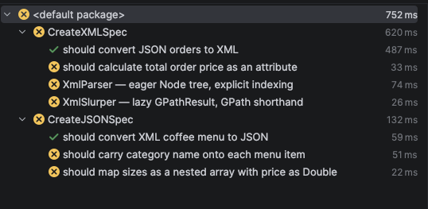
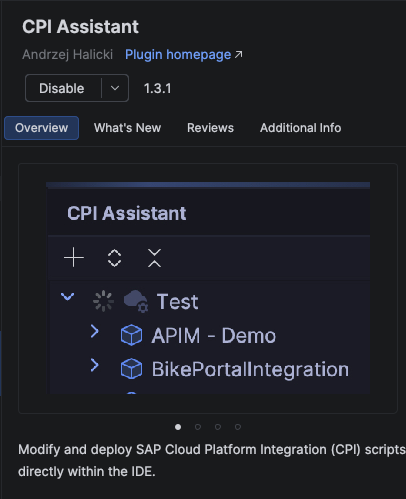
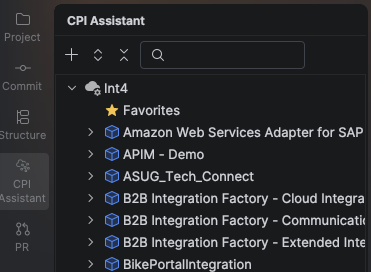
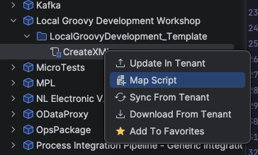
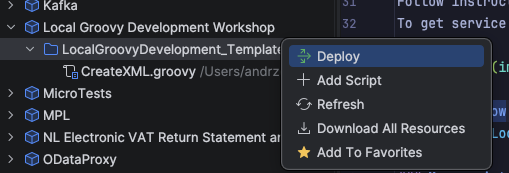

# groovy-template

## Setup

### Add Amazon Corretto 1.8 SDK in IntelliJ IDEA

1. Open **File > Project Structure** (`Cmd+;` on macOS / `Ctrl+Alt+Shift+S` on Windows/Linux).
2. In the left panel select **Project**.
3. Next to **SDK**, click the dropdown and choose **Add SDK > Download JDK...**.
4. In the dialog:
   - Set **Version** to `1.8`
   - Set **Vendor** to `Amazon Corretto`
   - Confirm the install location and click **Download**.
5. Once downloaded, select the newly added `corretto-1.8` from the **SDK** dropdown.
6. Click **Apply**, then **OK**.

### Test setup
1. Right click on `workshop/src/test/groovy`
2. Click `Run Tests in 'groovy'`
3. Tests should be executed with log in the bottom left corner
   

### Install CPI Assistant
1. Go to `IntelliJ IDEA>Settings>Plugins`
2. Search for `CPI Assistant`
3. 

3. Install the plugin and restart the IDE

### Add Int4 tenant
Follow instructions from https://github.com/andrzejhalicki/intellij-cpi-assistant and add Int4 tenant.
To get service key go to BTP Subaccount `Int4 Cloud Integration CF`, follow `Services > Instances and Subscriptions` and choose `dev-api-instance`. Click on `dev-api-key`, copy the service key and paste to the wizard window. The result should look like:

### Copy iFlow
In package `Local Groovy Development Workshop` copy iflow `LocalGroovyDevelopment_Template` and name it `LocalGroovyDevelopment_<initials>`. Change HTTPS adapter address to `/local-groovy-development/<initials>` and deploy.

### Map script from your iflow
In CPI Assistant find package `Local Groovy Development Workshop` and unfold your iflow. Right click on `CreateXML.groovy` and choose `Map script`.

Map the script to `workshop/src/main/resources/script/CreateXML.groovy`.

Now you are able to update script in Cloud Integration by clicking on `Update in Tenant`.
To deploy changes right click on iflow and choose `Deploy`.

